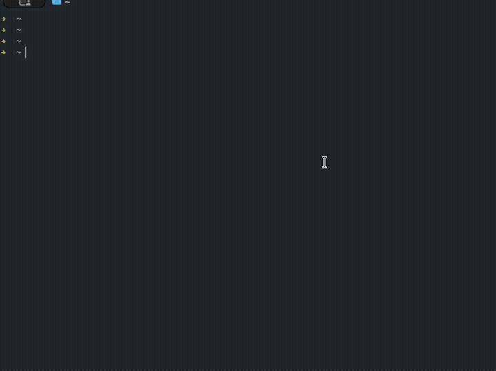

# askman

**Offline command-syntax retrieval and decision signals for terminal agents.**

- `askman` returns ranked terminal command matches from [tldr-pages](https://github.com/tldr-pages/tldr).
- In `--json` mode it returns execution-gating signals (`command`, `confidence`, `intent.status`, `intent.missing_terms`) so agents can execute or fall back safely.
- **`askman` goal is to enforce deterministic, verified behavior on AI agents when they execute shell commands.**

## Installation

### macOS / Linux

```bash
curl -fsSL https://raw.githubusercontent.com/0bmario/askman/main/install.sh | bash
```

### Cargo

```bash
cargo install --git https://github.com/0bmario/askman
```

## Quick Try

```bash
askman --json "remove files older than 7 days"
```

## Agent Integration

Add the [`.agents/skills/syntax-retriever/SKILL.md`](./.agents/skills/syntax-retriever/SKILL.md) file to your agent's skill directory.

### Agent Policy (TL;DR)

- Decompose multi-step tasks into separate `askman` queries.
- Execute only if the top result matches the intended command family, `confidence >= 0.8`, and `intent.status == "pass"`.
- Fall back to `man <tool>` or `<tool> --help` when evidence is weak (do not guess flags).

<details>
<summary>How it works</summary>

- `askman` uses semantic retrieval over command examples sourced from [tldr-pages](https://github.com/tldr-pages/tldr).
- On first run it downloads an embedding model (AllMiniLM-L6-v2) and a prebuilt SQLite command database; later lookups are offline.
- The query is embedded locally and matched against the SQLite database with [sqlite-vec](https://github.com/asg017/sqlite-vec) cosine distance.

</details>

---

## Uninstall

First, remove cached data (embedding model and database):

```bash
askman --clean
```

Then remove the binary itself:

- **If installed via `install.sh`:**

  ```bash
  rm ~/.local/bin/askman
  ```

- **If installed via `cargo`:**

  ```bash
  cargo uninstall askman
  ```

## Acknowledgments

Thanks to [tldr-pages](https://github.com/tldr-pages/tldr) for the curated command examples.

## Rebuilding the Database

```bash
cargo run --bin import_tldr --features="dev"
```

This automatically fetches the newest data from the tldr repository, extracts it, and generates a fresh commands database.

*(askman can also be used as a CLI lookup tool by human devs by omitting the `--json` flag.)*

<p align="center">
  
</p>
