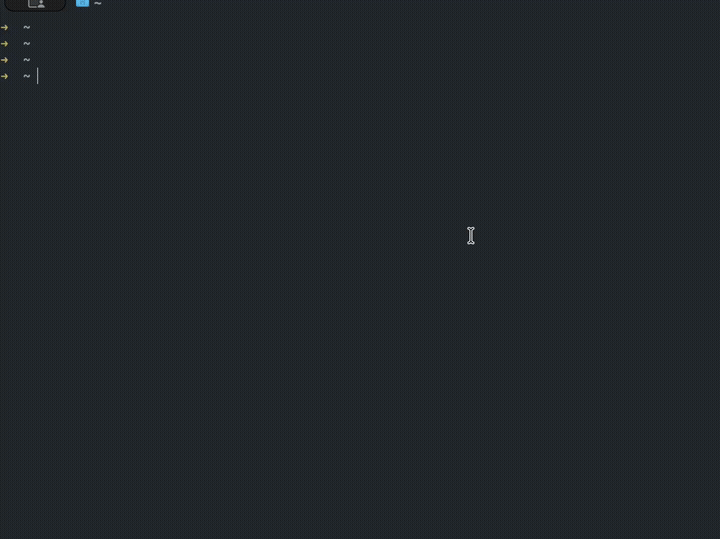

# askman

An offline CLI that finds terminal commands from natural language descriptions. Describe what you want to do and `askman` returns the closest matching command with examples.

<p align="center">
  
</p>

## Installation

### macOS / Linux

```bash
curl -fsSL https://raw.githubusercontent.com/0bmario/askman/main/install.sh | bash
```

### Cargo

```bash
cargo install --git https://github.com/0bmario/askman
```

On first run, `askman` downloads a small embedding model and the `commands.db` asset that matches the binary release version. After that, lookups run offline.

## Usage

```bash
askman move files to docs
```

By default, results are filtered to your host OS. Override that when you need a command for a different system:

```bash
askman --linux restart systemd
askman --osx flush dns
askman --windows clear dns cache
```

## How it works

- `askman` uses semantic search to match your query to real command examples from [tldr-pages](https://github.com/tldr-pages/tldr).
- Your query is embedded locally with [AllMiniLM-L6-v2](https://huggingface.co/sentence-transformers/all-MiniLM-L6-v2), then matched against a SQLite database through [sqlite-vec](https://github.com/asg017/sqlite-vec).
- After the initial model and database download, everything runs on your machine.

## Uninstall

First, remove cached data:

```bash
askman --clean
```

Then remove the binary itself: `rm ~/.local/bin/askman` or if installed via cargo `cargo uninstall askman`.

## Acknowledgments

Thanks to the [tldr-pages](https://github.com/tldr-pages/tldr) project. The command data used by `askman` comes from their collection of simplified examples.

## Rebuilding the Database

```bash
cargo run --bin import_tldr --features dev
```

This fetches the latest tldr pages, extracts them, and builds a fresh `commands.db` for your system.
